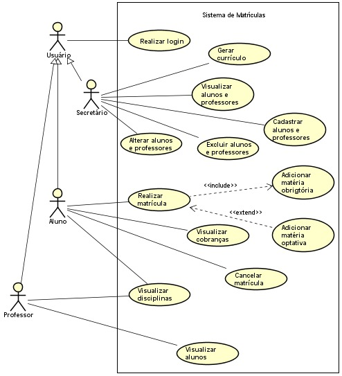

# Artefatos do projeto

Este diretório mantém os artefatos do projeto. 

Os artefatos do projeto estão separados da seguinte forma:
* `/Caso de Uso`
	* **README.md**: Descrição do diagrama de casos de uso.
	* **Sistema de Matrículas.asta**: Projeto feito no Astah do diagrama de casos de uso.
 * 

* `/Diagrama de Classes`
	* **README.md**: Descrição do diagrama de classes.
 * 

* `/Historia de usuário`
	* **backlog.md**: Descrição das histórias de usuário de acordo com os casos de uso.

* `/Imagens`
	* Arquivo cantendo todas as imagens utilizadas.
